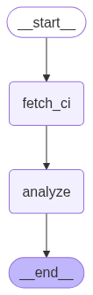

## 🚀 Features

* 🔍 Automatically fetches failed GitHub Actions CI runs.
* 📜 Extracts workflow YAML and failure logs.
* 🤖 Uses **Gemini 2.5 Flash** to analyze errors and propose actionable solutions.
* 🔁 Built on [LangGraph](https://python.langgraph.dev/) to define and run a simple stateful graph.

---
## ⚙️ Architecture

The pipeline is defined using LangGraph as:

1. **`fetch_ci`**

   * Retrieves the most recent failed CI run
   * Downloads the workflow YAML
   * Fetches associated logs

2. **`analyze`**

   * Sends the logs to Gemini for root cause analysis and fix suggestions

3. **Graph Output:**

   * A Mermaid-based visualization saved to `pipeline_graph.png`

---

## 📈 Output Graph

The tool auto-generates a visual representation of the LangGraph pipeline:

---
